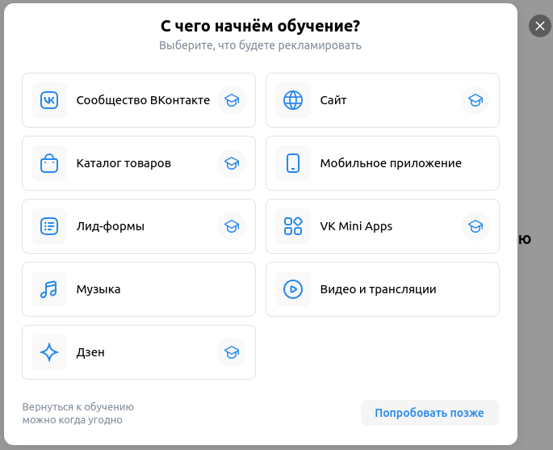

## Навбар

  

- При нажатии на логотип "VK Реклама" происходит переход на главную страницу (https://ads.vk.com/)

- При нажатии на кнопку

  - "Новости" открывается страница новостей (https://ads.vk.com/news)

  - "Форум идей" открывается страница форума идей (https://ads.vk.com/upvote)

  - "Монетизация" открывается страница монетизации (https://ads.vk.com/partner)

  - "Справка" открывается страница справки (https://ads.vk.com/help)

  - "Перейти в кабинет" происходит переход на страницу VKID (https://ads.vk.com/hq/dashboard?requiredAccount=advert)

  - "Кейсы" происходит переход на страницу кейсов (https://ads.vk.com/cases)

- При наведении курсора на "Обучение" и

  - выборе в выпадающем меню пункта "Полезные материалы" открывается страница полезных материалов (https://ads.vk.com/insights)

  - выборе в выпадающем меню пункта "Мероприятия" открывается страница мероприятий (https://ads.vk.com/events)

  - выборе в выпадающем меню пункта "Видеокурсы" происходит переход на сайт видеокурсов (https://expert.vk.com/catalog/courses/)
  
  - выборе в выпадающем меню пункта "Сертификация" происходит переход на сайт сертификаций (https://expert.vk.com/certification/)

## Футер

  

- При нажатии на логотип "VK Реклама" происходит переход на главную страницу (https://ads.vk.com/)

- При нажатии на кнопку "Перейти в кабинет" происходит переход на страницу VKID (https://ads.vk.com/hq/dashboard?requiredAccount=advert)

- При нажатии на ссылку

  - "Новости" открывается страница новостей (https://ads.vk.com/news)
  
  - "Полезные материалы" открывается страница полезных материалов (https://ads.vk.com/insights)
  
  - "Мероприятия" открывается страница мероприятий (https://ads.vk.com/events)
  
  - "Документы" открывается страница документов (https://ads.vk.com/documents)
  
  - "Обучение для бизнеса" происходит переход на страницу (https://expert.vk.com/)
  
  - "Кейсы" происходит переход на страницу кейсов (https://ads.vk.com/cases)

  - "Монетизация" открывается страница монетизации (https://ads.vk.com/partner)
  
  - "Помощь" открывается страница справки (https://ads.vk.com/help)

- При нажатии на логотип

  - "VK бизнес" происходит переход на страницу VK бизнеса (https://vk.company/ru/company/business/)

  - "VK" происходит переход страницу VK рекламы в VK (https://vk.com/vk_ads)
  
  - "OK" происходит переход на страницу VK рекламы в OK (https://ok.ru/group/64279825940712)
  
  - "Telegram" происходит переход на страницу сообщества VK рекламы в Телеграме (https://t.me/vk_ads)

- При нажатии на надпись языка "RU" или "EN" выпадает меню с выбором языка
- При нажатии на надпись языка "RU" или "EN" и выборе "English", страница становится на английском языке ("https://ads.vk.com/en")
- При нажатии на надпись языка "RU" или "EN" и выборе "Russian", страница становится на русском языке ("https://ads.vk.com/en") (не работает)
- При нажатии на сслыку "О кампании" происходит переход на страницу VK Company (https://vk.company/ru/)

## Обучение

   

- При нажатии на крестик окно обучения закрывается
- При нажатии на кнопку "Сообщество Вконтакте" окно меняется на окно "Как хотите учиться?" с тремя кнопками
- При нажатии на кнопку "Сообщество Вконтакте" и наведении курсора на "Настроить кампанию с подсказками" появляется попап с сообщение "Этот тип обучения пока недоступен" если сообщество ВКонтакте рекламодателя не создано
- При нажатии на кнопку "Сообщество Вконтакте" и нажатии на кнопку "Смотреть видеоурок от экспртов VK", окно меняется на окно с видеоукроком
- При нажатии на кнопку "Сообщество Вконтакте" и нажатии на кнопку "Смотреть курс на обучающей платформе" происходит переход на страницу обучающей платформы
- При наведении на значок шапки студента выпадает сообщение с текстом "Пошаговое обучение"

- При нажатии на кнопку "Каталог товаров" окно меняется на окно "Как хотите учиться?" с тремя кнопками
- При нажатии на кнопку "Каталог товаров" и наведении курсора на "Создать каталог с подсказками" происходит открытие страницы обучения каталогов (https://ads.vk.com/hq/ecomm/catalogs)
- При нажатии на кнопку "Каталог товаров" и нажатии на кнопку "Смотреть видеоурок от экспртов VK", окно меняется на окно с видеоукроком
- Создание каталога с подсказками

- При нажатии на кнопку "Лид-формы" окно меняется на окно "Как хотите учиться?" с четыремя кнопками
- При нажатии на кнопку "Лид-формы" и нажатии на "Настроить кампанию с подсказками" происходит открытие страницы обучения создания кампании (https://ads.vk.com/hq/ecomm/catalogs)
- При нажатии на кнопку "Лид-формы" и нажатии на "Создать лид-форму с подсказками" происходит открытие страницы обучения создания лид-формы (https://ads.vk.com/hq/leadads/leadforms)
- При нажатии на кнопку "Лид-формы" и нажатии на кнопку "Смотреть курс на обучающей платформе" происходит переход на страницу обучающей платформы
- При нажатии на кнопку "Лид-формы" и нажатии на кнопку "Смотреть видеоурок от экспртов VK", окно меняется на окно с видеоукроком
- Лид-формы. Настройка кампании с подсказками
- Создание лид-формы с подсказками

- При нажатии на кнопку "Музыка" окно меняется на окно "Как хотите учиться?" с двумя кнопками
- При нажатии на кнопку "Музыка" и нажатии на кнопку "Смотреть видеоурок от экспртов VK", окно меняется на окно с видеоукроком
- При нажатии на кнопку "Музыка" и нажатии на кнопку "Смотреть курс на обучающей платформе" происходит переход на страницу обучающей платформы

- При нажатии на кнопку "Дзен" окно меняется на окно "Как хотите учиться?" с тремя кнопками
- При нажатии на кнопку "Дзен" и нажатии на "Настроить кампанию с подсказками" происходит открытие страницы обучения создания кампании (https://ads.vk.com/hq/ecomm/catalogs)
- При нажатии на кнопку "Дзен" и нажатии на кнопку "Смотреть курс на обучающей платформе" происходит переход на страницу обучающей платформы
- При нажатии на кнопку "Дзен" и нажатии на кнопку "Смотреть видеоурок от экспртов VK", окно меняется на окно с видеоукроком
- Дзен. Настройка компании с подсказками

- При нажатии на кнопку "Сайт" окно меняется на окно "Как хотите учиться?" с тремя кнопками
- При нажатии на кнопку "Сайт" и нажатии на "Настроить кампанию с подсказками" происходит открытие страницы обучения создания кампании (https://ads.vk.com/hq/ecomm/catalogs)
- При нажатии на кнопку "Сайт" и нажатии на кнопку "Смотреть курс на обучающей платформе" происходит переход на страницу обучающей платформы
- При нажатии на кнопку "Сайт" и нажатии на кнопку "Смотреть видеоурок от экспртов VK", окно меняется на окно с видеоукроком
- Сайт. Настройка кампании с подсказками

- При нажатии на кнопку "Мобильное приложение" окно меняется на окно "Как хотите учиться?" с двумя кнопками
- При нажатии на кнопку "Мобильное приложение" и нажатии на кнопку "Смотреть курс на обучающей платформе" происходит переход на страницу обучающей платформы
- При нажатии на кнопку "Мобильное приложение" и нажатии на кнопку "Смотреть видеоурок от экспртов VK", окно меняется на окно с видеоукроком

- При нажатии на кнопку "VK Mini Apps" окно меняется на окно "Как хотите учиться?" с тремя кнопками
- При нажатии на кнопку "VK Mini Apps" и нажатии на "Настроить компанию с подсказками" происходит открытие страницы обучения создания компании (https://ads.vk.com/hq/ecomm/catalogs)
- При нажатии на кнопку "VK Mini Apps" и нажатии на кнопку "Смотреть курс на обучающей платформе" происходит переход на страницу обучающей платформы
- При нажатии на кнопку "VK Mini Apps" и нажатии на кнопку "Смотреть видеоурок от экспртов VK", окно меняется на окно с видеоукроком
- VK Mini Apps. Настройка кампании с подсказками

- При нажатии на кнопку "Видео и трансляции" окно меняется на окно "Как хотите учиться?" с двумя кнопками
- При нажатии на кнопку "Видео и трансляции" и нажатии на кнопку "Смотреть курс на обучающей платформе" происходит переход на страницу обучающей платформы
- При нажатии на кнопку "Видео и трансляции" и нажатии на кнопку "Смотреть видеоурок от экспртов VK", окно меняется на окно с видеоукроком

- При нажатии на кнопку "Попробоввать позже" окно закрывается

## Списки пользователей

  

- При нажатии на кнопку "Загрузить список" справа вылезает окно с загрузкой списка
- Загрузить список
- Отменить загрузку списка по кнопке "Отмена"
- При нажатии на кнопку с троеточием выпдает меню с одной ссылкой
- При активации внешнего списка пользователей открывается окно с полем для ввода ключа
- При активации внешнего списка пользователей открывается окно с полем для ввода ключа. При неверном введении ключа, появляется сообщение "Ключ не найден"
- Поделиться списком
- Поиск списка пользователей

## Сайты

  

- При добавлении пикселя и вводе неверного домена в поле ввода, появляется сообщение об ошибке
- Добавление нового пикселя
- Запрос уже существующего пикселя по ID
- Запрос уже существующего пикселя по неверному ID вызовет сообщение об ошибке
- Поиск доменов
- Переименование домена
- Удаление домена
- Добавление события домена
- Создание аудиторного тега домена
- Переименование аудиторного тега домена
- Удаление аудиторного тега домена
- Выдача доступа к домену

## Настройки. Права доступа

  

- Выдать права доступа аккаунту
- Выдать права доступа аккаунту с несуществующим id
