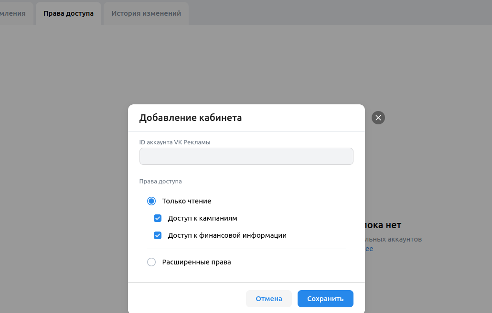
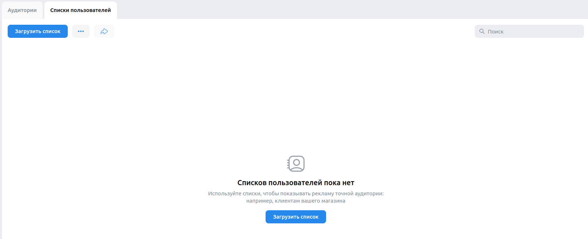
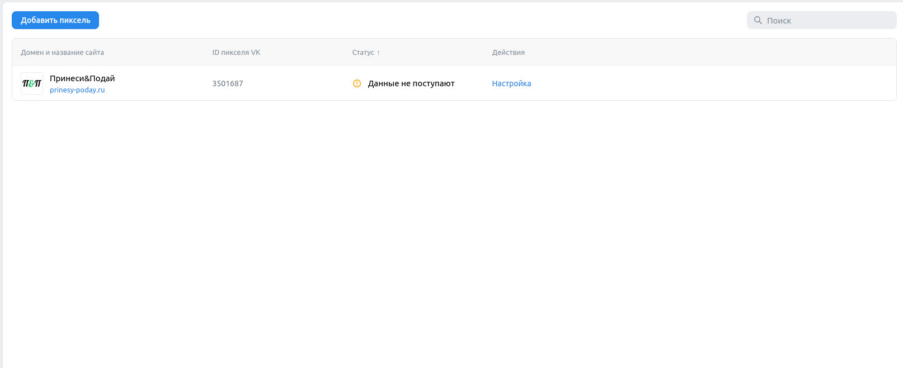

## Создание кампании

- При создании кампании по рекламе сайта, она появляется в списке кампаний и имеет целевое действие "Показы рекламы" и "Сайт"

- При создании кампании по рекламе каталога товаров, она появляется в списке кампаний и имеет целевое действие "Клики по рекламе" и "Каталог товаров"

- При создании кампании по рекламе сообщества ВК, она появлется в списке кампаний и имеет целевое действие "Подписка на сообщетсво" и "Сообщество ВКонтакте"

- При попытке создания предельной цены больше 5000, появляется сообщение об ошибке

- При дублировании группы при создании кампании, новая группа появляется слева

- При удалении группы из списка групп под кампанией, она пропадает из списка

- При создании кампании по рекламе сообщества ВК и попытке выбрать интересы и поведение "Opel", появится предупреждение о слишком малой аудитории

- При создании кампании по рекламе сообщества Одноклассников, она появляется в списке кампаний и имеет целевое действие "Подписка на сообщетсво" и "Одноклассники"

- При создании кампании по рекламе лид-форм и опросов, она появлется в списке кампаний и имеет целевое действие "Заполнение анкеты" и "Лид-формы"

- При создании кампании с форматом баннерной рекламы, она появлется в списке кампаний и имеет целевое действие "Показы рекламы" и "Баннерная реклама"

- При нажатии "Удалить" у кампании, кампания пропадает из списка кампаний

- При редактировании данных кампании в списке кампаний и нажатии "Сохранить", они сохраняются

## Настройки. Права доступа

  

- При нажатии на кнопку "Добавить кабинет", вводе неправильного id в поле ввода id и нажатии на кнопку "Сохранить" появится сообщение о неверном id

## Списки пользователей

  

- При нажатии на кнопку "Загрузить список" справа вылезает окно с загрузкой списка

- При нажатии на кнопку  троеточие и выборе кнопки "Активировать список пользователей", затем вводе данных о несуществющем в поле ключа появляется сообщение о том, что ключ не найден

- При вводе в поле поиска данных о списках,которых нет текст в центре заменяется на "Ничего не найдено"

## Сайты

  

- При нажатии кнопки "Добавить пиксель", вводе домена и нажатии кнопки "Создать новый пиксель" появляется новая запись в списке пикселей

- При добавлении пикселя и вводе неверного домена в поле ввода появляется сообщение об ошибке

- Запрос уже существующего пикселя по неверному ID вызовет сообщение об ошибке

- При нажатии на запись пикселя, затем на кнопку "Добавить событие", вводе название события, выборе категории "Покупка", выборе пункта "Ручная настройка", выборе условия наступления "Посещена страница", вводе в поле "URL содержит" "prinesy-poday.ru" и нажатии на кнопку "Добавить событие", создастся запись о событии с сответсвтующими данными

- При нажатии на троеточие у записи пикселя, выборе "Удалить пиксель" и выборе кнопки "Удалить" в модальном окне запись о пикселе пропадает

# Старая версия чек-листов
## Навбар

  

- При нажатии на логотип "VK Реклама" происходит переход на главную страницу (https://ads.vk.com/)

- При нажатии на кнопку

  - "Новости" открывается страница новостей (https://ads.vk.com/news)

  - "Форум идей" открывается страница форума идей (https://ads.vk.com/upvote)

  - "Монетизация" открывается страница монетизации (https://ads.vk.com/partner)

  - "Справка" открывается страница справки (https://ads.vk.com/help)

  - "Перейти в кабинет" происходит переход на страницу VKID (https://ads.vk.com/hq/dashboard?requiredAccount=advert)

  - "Кейсы" происходит переход на страницу кейсов (https://ads.vk.com/cases)

- При наведении курсора на "Обучение" и

  - выборе в выпадающем меню пункта "Полезные материалы" открывается страница полезных материалов (https://ads.vk.com/insights)

  - выборе в выпадающем меню пункта "Мероприятия" открывается страница мероприятий (https://ads.vk.com/events)

  - выборе в выпадающем меню пункта "Видеокурсы" происходит переход на сайт видеокурсов (https://expert.vk.com/catalog/courses/)
  
  - выборе в выпадающем меню пункта "Сертификация" происходит переход на сайт сертификаций (https://expert.vk.com/certification/)

## Футер

  

- При нажатии на логотип "VK Реклама" происходит переход на главную страницу (https://ads.vk.com/)
- При нажатии на кнопку "Перейти в кабинет" происходит переход на страницу VKID (https://ads.vk.com/hq/dashboard?requiredAccount=advert)
- При нажатии на ссылку
  - "Новости" открывается страница новостей (https://ads.vk.com/news)
  - "Полезные материалы" открывается страница полезных материалов (https://ads.vk.com/insights)
  - "Мероприятия" открывается страница мероприятий (https://ads.vk.com/events)
  - "Документы" открывается страница документов (https://ads.vk.com/documents)
  - "Обучение для бизнеса" происходит переход на страницу (https://expert.vk.com/?utm_source=vk_ads_blog&utm_medium=futer)
  - "Кейсы" происходит переход на страницу кейсов (https://ads.vk.com/cases)
  - "Монетизация" открывается страница монетизации (https://ads.vk.com/partner)
  - "Помощь" открывается страница справки (https://ads.vk.com/help)

- При нажатии на логотип
  - "VK бизнес" происходит переход на страницу VK бизнеса (https://vk.company/ru/company/business/)
  - "VK" происходит переход страницу VK рекламы в VK (https://vk.com/vk_ads)
  - "OK" происходит переход на страницу VK рекламы в OK (https://ok.ru/group/64279825940712)
  - "Telegram" происходит переход на страницу сообщества VK рекламы в Телеграме (https://t.me/vk_ads)

- При нажатии на надпись языка "RU" или "EN" выпадает меню с выбором языка
- При нажатии на надпись языка "RU" или "EN" и выборе "English", страница становится на английском языке ("https://ads.vk.com/en")
- При нажатии на надпись языка "RU" или "EN" и выборе "Russian", страница становится на русском языке ("https://ads.vk.com/ru") (не работает)
- При нажатии на ссылку "О кампании" происходит переход на страницу VK Company (https://vk.company/ru/)

